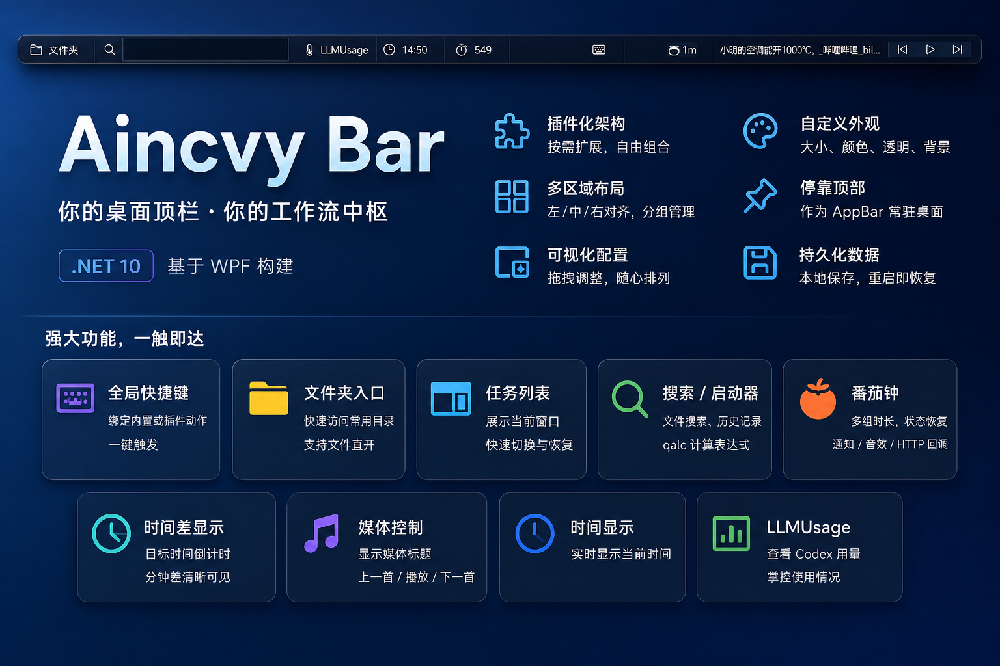

# Aincvy Bar

`Aincvy Bar` 是一个基于 WPF 的 Windows 顶部工具栏应用，支持多插件组合、可视化布局、自定义外观，以及面向个人工作流的快捷操作能力。

## 项目特性

- 基于 `net10.0-windows10.0.19041.0` 与 WPF 构建，适合常驻桌面的轻量工具栏场景。
- 内置插件式架构，功能模块按插件组织，便于扩展和维护。
- 支持多区域布局，可将插件放到左、中、右对齐位置，并划分多个布局分组。
- 支持拖拽调整插件顺序、启用状态和布局分布。
- 支持自定义窗口大小、启动位置、背景色、背景图、透明度、置顶等外观设置。
- 支持停靠到屏幕顶部，作为 AppBar 使用。
- 配置与插件数据持久化到本地用户目录，重启后可恢复设置与部分运行状态。

## 当前支持的功能

### 1. 全局 HotKey

- 配置一个或多个全局快捷键。
- 快捷键可绑定到内置动作或插件动作。
- 当前支持的动作包括：打开应用、聚焦输入框、开始/暂停/停止番茄钟等。

### 2. 文件夹快捷入口

- 配置常用目录快捷方式。
- 可直接展开目录，浏览子目录和文件。
- 支持直接打开文件夹或文件。

### 3. 任务列表

- 展示当前可见应用窗口。
- 支持快速切换、恢复窗口。
- 适合作为系统任务栏的补充入口。

### 4. 输入搜索 / 启动器

- 提供常驻输入框，用于快速搜索文件。
- 支持配置多个搜索路径，并可与文件夹快捷方式联动。
- 支持结果排序与历史选择记录。
- 支持通过 `qalc` 进行数学表达式计算。
  说明：只有当 `qalc` 可执行文件路径配置正确且文件存在时才会启用。

### 5. 番茄钟

- 支持多组时长配置。
- 支持开始、暂停、恢复、重置。
- 支持运行状态恢复。
- 到时可发送系统通知。
- 支持播放完成提示音。
- 支持在完成后发起 HTTP 请求，适合与外部自动化流程联动。

### 6. 时间差显示

- 显示当前时间距离目标时间的分钟差。
- 可用于下班倒计时、会议提醒等场景。

### 7. 媒体控制

- 显示当前媒体标题。
- 支持上一首、播放/暂停、下一首。
- 基于 Windows 系统媒体会话控制当前播放源。

### 8. 时间显示

- 在工具栏中实时显示当前时间。

### 9. LLMUsage / Codex 用量

- 在工具栏中显示 `LLMUsage` 按钮，点击后可查看当前账号的 Codex 用量。

## 数据与配置

应用数据默认保存在 `%LocalAppData%/AincvyBar` 下：

- 主配置：`bar-settings.json`
- 日志目录：`logs/`
- 插件数据目录：`plugins/`
